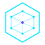

<div align="center">



# 3D Kame House

**Portfolio & Professional Certification Site**

[](https://vercel.com/new/clone?repository-url=https://github.com/devjaime/3dkamehouse)


[🇪🇸 Leer en Español](#español) · [🌐 Live Demo](https://3dkamehouse.vercel.app)

</div>

---

## English

### Overview

**3D Kame House** is a Chilean 3D printing company specializing in rapid prototyping, technical parts, and custom products. This repository contains the official portfolio and professional certification website — built to showcase the company's services and formally validate the contributions of key team members.

**Dual purpose:**
- 📦 **Company portfolio** — Services, projects, and team presentation
- 🏅 **Professional credential** — Formal certification for [Cristian Garcia Salazar](https://github.com/devjaime/3dkamehouse#certification) as Jefe de Proyectos e Innovación (Oct 2020 – Apr 2022), signed by Jaime Hernández (Supervisor de Operaciones)

---

### Tech Stack

| Layer | Technology |
|---|---|
| Framework | [Next.js 15](https://nextjs.org) (App Router) |
| Language | TypeScript 5.7 |
| Styling | Tailwind CSS v4 |
| Animations | CSS Keyframes (zero JS libs) |
| 3D Printer Animation | Custom SVG + CSS |
| Explainer Videos | [Remotion](https://remotion.dev) |
| Deploy | [Vercel](https://vercel.com) · Region: `gru1` (São Paulo) |
| Fonts | Orbitron · Inter · JetBrains Mono |

---

### Features

- **Animated 3D Printer** — CSS-only SVG FDM printer with moving carriage, glowing nozzle, rotating spool, live temp readouts
- **Terminal Hero** — Simulated print job console with typewriter animation
- **Certification Section** — Formal credential document with seal, achievements, and signature
- **Remotion Videos** — 3 programmatic explainer videos (1280×720 @ 30fps) for each service
- **Dark Futuristic Theme** — Cyan / violet / orange palette on deep dark backgrounds
- **Fully Static** — 100% pre-rendered, no server required, instant CDN delivery
- **Zero external UI deps** — No component libraries, pure Tailwind + custom CSS

---

### Project Structure

```
3dkamehouse/
├── src/
│   ├── app/
│   │   ├── globals.css          # Design system: @theme tokens, all keyframes
│   │   ├── layout.tsx           # SEO metadata + Google Fonts
│   │   └── page.tsx             # Page assembly
│   ├── components/
│   │   ├── Navbar.tsx           # Fixed glassmorphism nav
│   │   ├── Hero.tsx             # Terminal animation + 3D printer
│   │   ├── Printer3D.tsx        # ⭐ Animated SVG FDM printer
│   │   ├── AboutCompany.tsx     # Company overview + metrics
│   │   ├── Services.tsx         # 4 service cards
│   │   ├── VideoShowcase.tsx    # ⭐ Remotion video showcase (tab UI)
│   │   ├── Team.tsx             # Jaime Hernández + Cristian Garcia
│   │   ├── Certification.tsx    # ⭐ Formal credential document
│   │   ├── Projects.tsx         # 3 featured projects
│   │   ├── Contact.tsx          # Form + WhatsApp + email
│   │   └── Footer.tsx
│   └── data/
│       └── content.ts           # All Spanish (CL) content centralized
├── video/                       # Remotion video project
│   ├── src/
│   │   ├── Root.tsx             # Composition registry
│   │   ├── shared/
│   │   │   ├── BrandIntro.tsx   # Animated logo intro (2.5s)
│   │   │   ├── StepSlide.tsx    # Process step slide (5s each)
│   │   │   └── OutroSlide.tsx   # CTA outro (3s)
│   │   └── compositions/
│   │       ├── PrototipadoVideo.tsx
│   │       ├── PiezasTecnicasVideo.tsx
│   │       └── ProductoPersonalizadoVideo.tsx
│   └── package.json
├── public/
│   └── icon.svg                 # Wireframe cube logo
├── next.config.ts
├── vercel.json                  # Deployment config (headers, region)
└── tsconfig.json
```

---

### Getting Started

#### Prerequisites
- Node.js ≥ 18.17
- npm ≥ 9

#### Local Development

```bash
# Clone
git clone https://github.com/devjaime/3dkamehouse.git
cd 3dkamehouse

# Install & run
npm install
npm run dev
# → http://localhost:3000
```

#### Build for Production

```bash
npm run build
npm start
```

#### Generate Remotion Videos

```bash
cd video
npm install

# Preview in Remotion Studio
npm start

# Render all 3 videos to video/out/
npm run render:all

# Copy to public/ to serve them from the site
cp out/*.mp4 ../public/videos/
```

---

### Deployment on Vercel

1. Import this repo at [vercel.com/new](https://vercel.com/new)
2. Vercel auto-detects Next.js — **no configuration needed**
3. Click **Deploy**

> No environment variables required. The `vercel.json` is pre-configured with security headers and `gru1` region (São Paulo — closest Vercel region to Chile).

---

### Certification

This site formally validates the professional participation of:

| Field | Value |
|---|---|
| **Name** | Cristian Garcia Salazar |
| **Role** | Jefe de Proyectos e Innovación |
| **Period** | October 16, 2020 → April 10, 2022 |
| **Contract** | Indefinido |
| **Signed by** | Jaime Hernández — Supervisor de Operaciones |
| **Company** | 3D Kame House · RUT 15.458.517-6 |

**Key achievements:**
- Integral improvement of company logistics projects
- Leadership of stalled commercial area projects
- Optimization of customer response times
- Development of the "Requerimientos de producto" sales artifact

---

### License

Private · © 2024 3D Kame House · RUT 15.458.517-6 · Santiago, Chile

---

---

## Español

<a name="español"></a>

### Descripción

**3D Kame House** es una empresa chilena de impresión 3D especializada en prototipado rápido, piezas técnicas y productos personalizados. Este repositorio contiene el sitio web oficial de portfolio y certificación profesional.

**Propósito dual:**
- 📦 **Portfolio de la empresa** — Servicios, proyectos y presentación del equipo
- 🏅 **Credencial profesional** — Certificación formal de [Cristian Garcia Salazar](#certificacion) como Jefe de Proyectos e Innovación (oct 2020 – abr 2022), avalada por Jaime Hernández (Supervisor de Operaciones)

---

### Stack Tecnológico

| Capa | Tecnología |
|---|---|
| Framework | [Next.js 15](https://nextjs.org) (App Router) |
| Lenguaje | TypeScript 5.7 |
| Estilos | Tailwind CSS v4 |
| Animaciones | CSS Keyframes (sin librerías JS) |
| Animación Impresora 3D | SVG + CSS personalizado |
| Videos Explicativos | [Remotion](https://remotion.dev) |
| Deploy | [Vercel](https://vercel.com) · Región: `gru1` (São Paulo) |
| Fuentes | Orbitron · Inter · JetBrains Mono |

---

### Características

- **Impresora 3D Animada** — Impresora FDM en SVG puro con cabezal móvil, nozzle con calor pulsante, bobina rotando y lecturas de temperatura en vivo
- **Hero Terminal** — Consola de impresión simulada con animación de escritura
- **Sección Certificación** — Documento formal con sello, logros y firma
- **Videos Remotion** — 3 videos explicativos programáticos (1280×720 @ 30fps) por cada servicio
- **Tema Oscuro Futurista** — Paleta cyan / violeta / naranja sobre fondos oscuros
- **100% Estático** — Pre-renderizado, sin servidor, distribución instantánea por CDN
- **Sin dependencias de UI** — Sin librerías de componentes, solo Tailwind + CSS personalizado

---

### Instalación y Uso

#### Requisitos
- Node.js ≥ 18.17
- npm ≥ 9

#### Desarrollo Local

```bash
# Clonar
git clone https://github.com/devjaime/3dkamehouse.git
cd 3dkamehouse

# Instalar y ejecutar
npm install
npm run dev
# → http://localhost:3000
```

#### Construir para Producción

```bash
npm run build
npm start
```

#### Generar Videos con Remotion

```bash
cd video
npm install

# Vista previa en Remotion Studio
npm start

# Renderizar los 3 videos en video/out/
npm run render:all

# Copiar a public/ para servir desde el sitio
cp out/*.mp4 ../public/videos/
```

---

### Despliegue en Vercel

1. Importar este repositorio en [vercel.com/new](https://vercel.com/new)
2. Vercel detecta Next.js automáticamente — **no se requiere configuración**
3. Click en **Deploy**

> Sin variables de entorno requeridas. El `vercel.json` viene preconfigurado con headers de seguridad y región `gru1` (São Paulo — región Vercel más cercana a Chile).

---

### Certificación

<a name="certificacion"></a>

Este sitio valida formalmente la participación profesional de:

| Campo | Valor |
|---|---|
| **Nombre** | Cristian Garcia Salazar |
| **Cargo** | Jefe de Proyectos e Innovación |
| **Período** | 16 de octubre de 2020 → 10 de abril de 2022 |
| **Contrato** | Indefinido |
| **Firma** | Jaime Hernández — Supervisor de Operaciones |
| **Empresa** | 3D Kame House · RUT 15.458.517-6 |

**Principales resultados:**
- Mejora integral en proyectos logísticos de la empresa
- Liderazgo de proyectos estancados del área comercial
- Optimización de tiempos de respuesta al cliente final
- Mejora del artefacto de venta de productos «Requerimientos de producto»

---

### Contacto

| Canal | Información |
|---|---|
| Email | contacto@3dkamehouse.cl |
| WhatsApp | +56 9 4928 8019 |
| Ubicación | Santiago, Chile |

---

### Licencia

Privado · © 2024 3D Kame House · RUT 15.458.517-6 · Santiago, Chile
